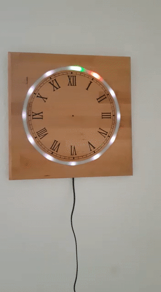
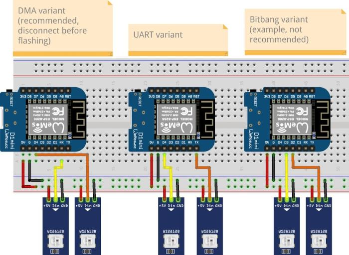
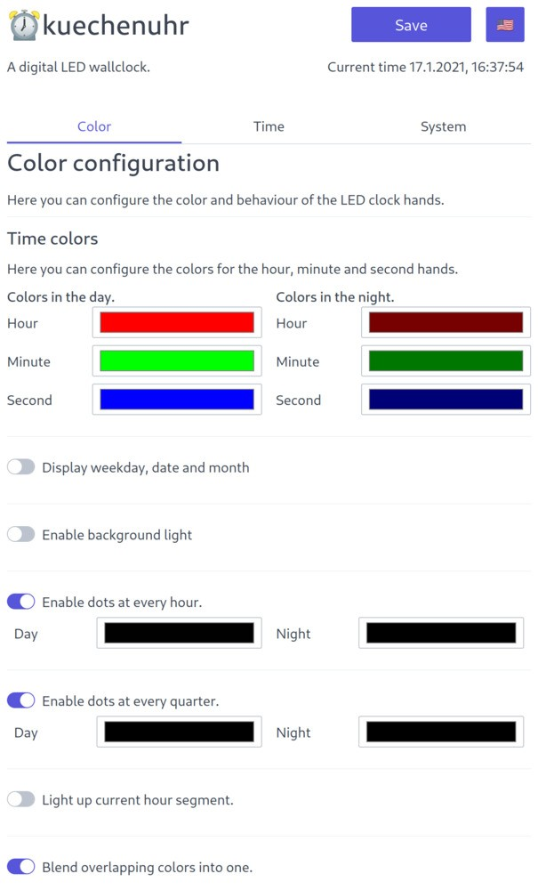

# ESP8266 WS2812/NeoPixel wall clock



This is a firmware for a ESP8266 based NeoPixel / WS281x clock. It shows the hour, minute and second of the day using the LEDs.

The firmware automatically gets the current time via NTP, supports timezones and will automatically switch to DST.

The colors of the clock are entirely configurable. The "hands" can have different colors in the night. Colors for the quarters, hours and the current hour segment are configurable as well.

## Hardware

To build a clock like that you'll need an ESP8266 microcontroller. It should have one freely usable GPIO pin. You'll also need a WS2812/WS2813/NeoPixel LED strip with 60 or more LEDs. The time is always displayed in the first 60 LEDs. You can also let the clock display the current weekday, date an month. It's recommended to use a strip with more than 60 LEDs to show the date.

Connect the strip to the ESP with +5V going to +5V on the ESP, GND to GND and the data line of the strip to the GPIO.

You can also add a second strip as a backlight.

The firmware comes in three variants. The DMA variant that uses GPIO 3 for the time strip and GPIO 2 for the optional backlight strip.

The UART variant useses GPIO 2 for the time strip and GPIO 1 for the backlight strip. The bitbanging variant enables you to freely select the pin, but it might be unstable and is not recommended. For more details see the [NeoPixelBus Wiki](https://github.com/Makuna/NeoPixelBus/wiki/ESP8266-NeoMethods).

**To flash the DMA and UART firmware make sure to disconnect the LED strips from the ESP, because they will turn on randomly and might turn out and burn out your power suppy or ESP.**



If you use the firmware with the NeoPixelBus bitbanging method, there might be issues with longer LED strips. Strips up to 60 LEDs worked fine for me. If you have issues with the LEDs not lighting up correctly change the method in the code and build your own version. See the [NeoPixelBus wiki](https://github.com/Makuna/NeoPixelBus/wiki/ESP8266-NeoMethods#neoesp8266dma800kbpsmethod) for further details.

## Setup

To use the firmware flash the `firmware_esp8266.bin` found in the releases list with the [esptool](https://github.com/espressif/esptool). The build for the ESP32 is experimental and unsupported.

```plaintext
esptool.py --port PORT write_flash 0x0 firmware.bin
```

After the flashing is done connect to the WiFi access point starting with "⏰ESPCLOCK-...". Connect to it and open the URL [http://192.168.4.1](http://192.168.4.1). Configure your WiFi credentials and check the IP address of the clock in the web interface of your router. Open the address of the clock in your browser to change the settings according to your needs.

## Settings

The webinterface supports a lot of features. Some might not be working in your clock, if you miss the neccessary hardware.

### Color and time settings

The first tab controls the color of the hands, hour dots, quarter dots, hour segment, date and backlight. The segment are the stretch of LEDs that reflect the current hour. The colors can differ between night and day to make a clock dimmed in the night and bright in the day. When the night colors should be used is definded by following section.



If you want, you can show dots for the weekday, date and month. Just enable the option and define your preferred colors. To define the positions of those dots, switch to the "System" tab.

The clock can also drive a second strip to work as a backlight. The backlight strip can light up in diffrent colors in the day or night. It will light up with the hour rainbow or the alarm.

Enabling the hour dots, quarter hour dots and the option to light up the current hour segment might increase the legibility of the clock.

If you want the colors of two elements to blend when they overlap enable "Blend colors when lights overlap". For example a red hour hand and a blue seconds hand overlapping will create a purple light.

### Time settings

To enable a fluid progression of brightness between seconds set the fluid motion option.

You can select the style of the hour hand. The "simple" mode is just one pixel lighting up. The "wide" mode is three pixels with the outer ones dimmed. The "split" mode is three pixels with the middle one off.

To have the clock light up in a rainbow color on the hour just check the box.

If you want a visual alarm at a certain time, you can enable it in the "Alarm"-section and set the time. The clock will flash in red for a minute, when the alarm is set.

The beginning and end of the night mode can also be set.

To select your current timezome just click on the dropdown field and look for your contintent and city.

### System settings

To select the GPIO pin that is connected to the data line of your LED strip select a pin. This is the raw GPIO pin number so check the datasheet of your ESP-model for the correct number.

If your strip contains more or less than 60 LEDs you can specify them. Note that due to rounding issues there will be skips in the LEDs. 60 LEDs is the optimum to display the time. There currently is no interpolation for more or less than 60 LEDs. To show the date you should use a longer LED strip.

There is a second set of options for the background light strip.

You can dynamically define the position of the time, weekday, date and month on the LED strip. Just move the sliders to fit your clock.

If your LED strip does not start at the top for (12 o'clock). You can add an offset by specifing the pixel located at the top. This only affects the time, not the date.

The clock will get the current time from the defined NTP time server. `pool.ntp.org` is a good start. `time.windows.com` and `time.google.com` are good alternatives. Some home routers even offer an integrated NTP server.

To make the clock easier identifiable you can also change it's hostname. If your local WiFi router resolves local hostnames it will be reachable by that name.

If you want to integrate the clock in to a smart home system, you can enable the MQTT feature. This will allow you to control the clock via MQTT. The following topics will be created:

| Topic                 | Description                                                                                         |
|-----------------------|-----------------------------------------------------------------------------------------------------|
| (BASETOPIC)/status    | will show the current status of the clock.                                                          |
| (BASETOPIC)/command   | receives a command to make the clock show the "time", an "alarm", a "rainbow" or turn itself "off". |
| (BASETOPIC)/config    | dumps the config data everytime the clock settings are changed.                                     |
| (BASETOPIC)/setConfig | receives config data to change the clock settings.                                                  |

If something is messed up or you just want to reset the clock click the "Reset all settings" button. It will completely remove all settings from the ESP.

You can update the firmware version using the web interface by uploading a file in the "Firmware update" section.

If your clock misbehaves you can reset it with the "Reset clock" function.

### Saving

Some changes, like the colors, are updated immediately but not permamently saved. To make save them permanently, click the big purple button at the top.

Changes to the LED strip configuration or the timezone will need a restart of the ESP.

## Notes and Links

The firmware has been build with [PlatformIO](https://platformio.org/). It uses the libraries [WifiManager](https://github.com/tzapu/WiFiManager), [ArduinoJSON](https://arduinojson.org/), [NeoPixelBus](https://github.com/Makuna/NeoPixelBus/), [PubSubClient](https://github.com/knolleary/pubsubclient) and [ezTime](https://github.com/ropg/ezTime). The web interface uses [Spectre.css](https://picturepan2.github.io/spectre/) for styling.

The software was inspired by the [esp8266-NeoPixel-Clock](https://github.com/radimkeseg/esp8266-NeoPixel-Clock) by Radim Keseg. The rainbow was taken from an [example by ACROBOTIC](https://github.com/acrobotic/Ai_Demos_NeoPixelBus/blob/master/Rainbow/Rainbow.ino). The string splitting function was taken from [here](https://github.com/BenTommyE/Arduino_getStringPartByNr/blob/master/getStringPartByNr.ino).

If your strip uses a different color order than GRB you also have to modify the firmware, to have proper color reproduction. The [NeoPixelBus wiki](https://github.com/Makuna/NeoPixelBus/wiki/NeoPixelBus-object#neo-features) is also helpful for that.

The firmware should work with the ESP32, but you'll have to compile it yourself and I haven't tested it.
